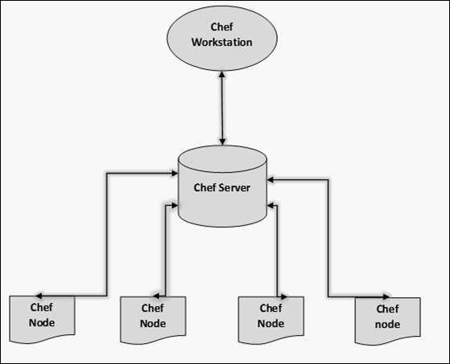
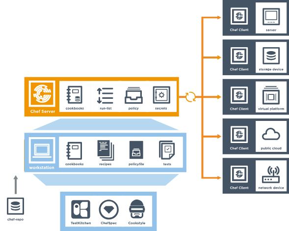
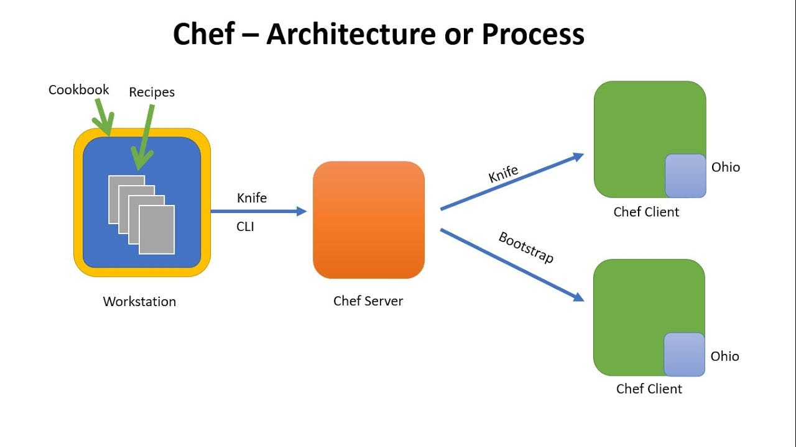
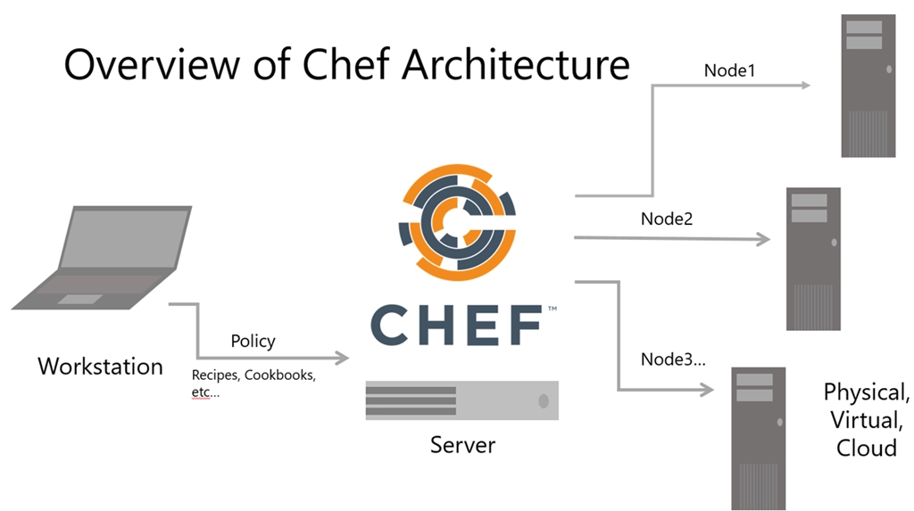
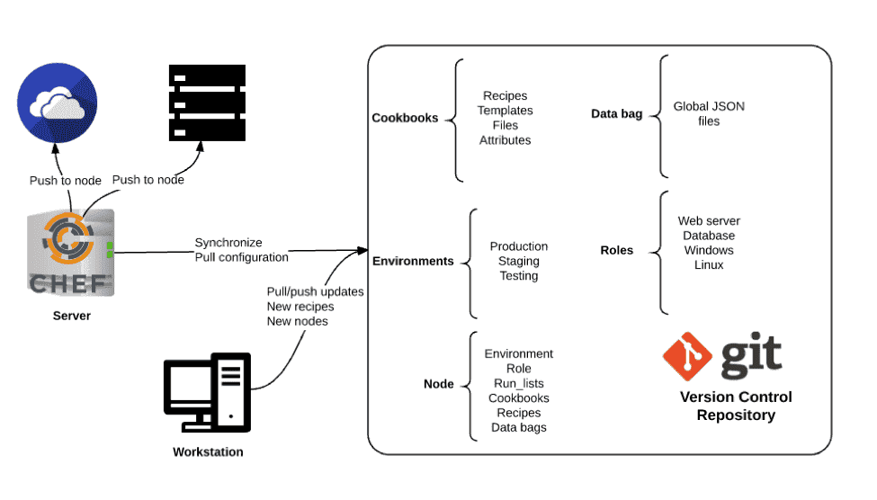
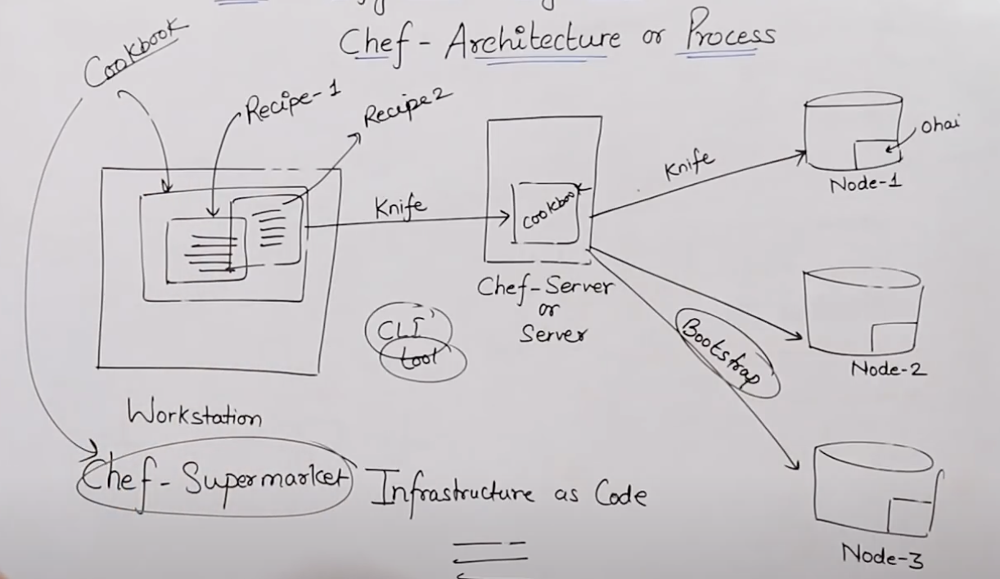

# CHEF

- Chef is a company and the name of a configuration management tool written in Ruby and Erlang.
- Founded by Adom Jacobs in year 2009.
- Actual name was "Marionette" later renamed to 'chef'.
- On April 2, 2019 the company announced that all their product are now open source under the Apache 2.0 license.
- Chef is used by Facebook, AWS, opswork, HP public cloud etc.
- Chef is an administrator tool, whatever system administrator used to do manually, now we are automating all the task by using chef.

# Configuration Management

- It is a method through which we automate the admin tasks.
- Configuration management tool turns your code into infrastructure.
- So your code will be Repeatable, Testable and Versionable.

# Advantage of Configuration Management(CM) Tool

- Complete Automation
- Increase Uptime
- Improve Performance
- Ensure Compliance
- Prevent Errors
- Reduce Cost

# Chef Architecture

#

# Workstation

- Where you write code.
- Workstation are persional computer or vertual server where all configuration code is created, tested or changed.
- DevOps engineer actually sits here and write codes. This code is called "Recipe"
- A collection of Recipe is called "Cookbook"
- Workstation communicate with chef-server using "knife"
- knife is command line tool that upload cookbook to the server.

# Chef-Server

- Where you store code
- The chef-server is the middle man between workstation and nodes.
- <mark>All "cookbooks" are stored here.</mark>
- Server may be hosted localy or remote.

# Node

- Where you apply code
- Nodes are the system that requires the configurations.
- <mark>Ohai</mark> fetches the current state of the node located in.
- Node communicate with the <mark>chef-server</mark> using the <mark>chef-client</mark>
- Each node can have a different configuration required.
- chef-client is installed on every node.

# Knife

- Tool to established communication among workstation, server, and node.
- Knife is a command-line tool that runs on workstation.

# Chef Client

- Tool runs on every nodes to pull the configuration code from chef-server.
- Gather current system configuration
- Download the desired system configuration from the chef-server.
- Configure the node such that it adher to the policy.

# Ohai

- Maintain current state information of chef node.

# Indempotency

- Tracking the state of the system resources to ensure that the changes should not reapply repeatedly.

# Chef-Supermarket

- where you get custom code.
