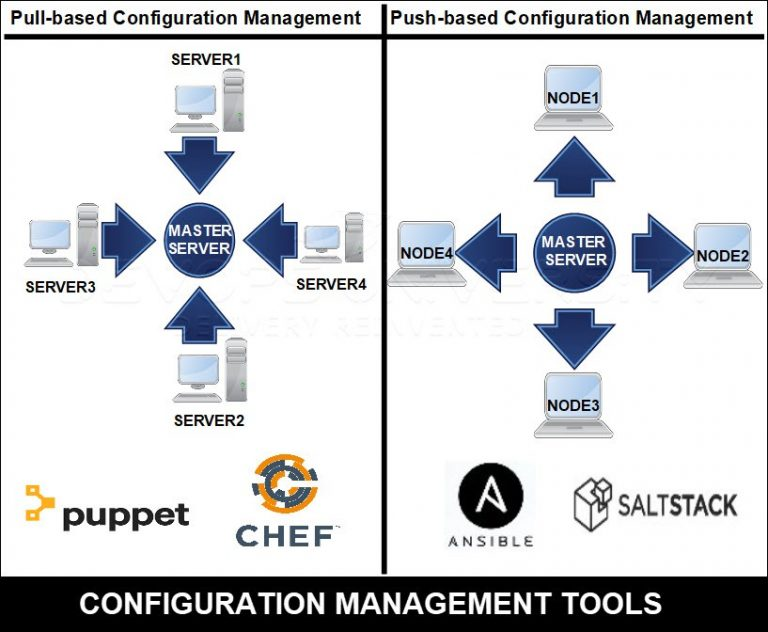
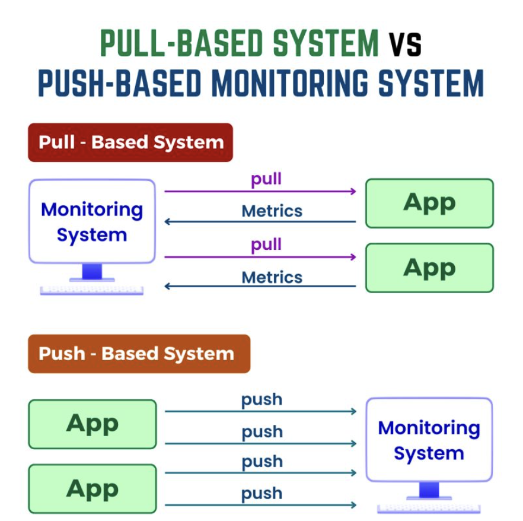

# CHEF - Configuration Management Tool

## Configuration Management Tool

# Push-Based Configuration Management Tool

A **push-based configuration management tool** is a system that actively pushes configurations from a central server to managed nodes (servers, containers, or devices) without waiting for them to pull updates. In this approach, the central server initiates the configuration updates and ensures that the desired state is applied to the nodes.

## 🔹 How Push-Based Tools Work

1. **Centralized Control** – The configuration management server sends commands and configurations to target nodes.
2. **Immediate Execution** – Changes are applied as soon as the server issues them.
3. **Agentless or Agent-Based** – Some tools require an agent on the target machine, while others use SSH or APIs to apply configurations.
4. **Fast and Efficient** – Useful when real-time changes are needed across multiple nodes.

## 🔹 Examples of Push-Based Configuration Management Tools

| Tool                           | Description                                                                    |
| ------------------------------ | ------------------------------------------------------------------------------ |
| **Ansible**                    | Uses SSH to push configurations to remote systems. Agentless.                  |
| **SaltStack** (in push mode)   | Uses a "master" server to push configurations to "minions".                    |
| **Puppet** (with Bolt)         | Although Puppet is primarily pull-based, **Bolt** allows push-based execution. |
| **CFEngine** (Enterprise mode) | CFEngine’s policy server can push changes to clients.                          |

## 🔹 Push-Based vs. Pull-Based Configuration Management

| Feature                  | Push-Based                              | Pull-Based                                   |
| ------------------------ | --------------------------------------- | -------------------------------------------- |
| **Control**              | Centralized, server-initiated           | Decentralized, client-initiated              |
| **Execution**            | Immediate                               | Periodic                                     |
| **Scalability**          | Better for small-to-medium environments | Ideal for large environments                 |
| **Dependency on Agents** | Can be agentless (e.g., Ansible)        | Usually requires agents (e.g., Puppet, Chef) |

## 🔹 When to Use Push-Based Configuration Management?

✅ When you need **immediate** updates and quick configuration changes.  
✅ When managing a **small to medium** number of servers.  
✅ When working in **dynamic cloud environments** where infrastructure frequently changes.  
✅ When you want an **agentless** approach (e.g., Ansible).

#

# Pull-Based Configuration Management Tool

A **pull-based configuration management tool** is a system where managed nodes (servers, containers, or devices) periodically pull configuration updates from a central server. Instead of the server actively pushing updates, the nodes check in and apply the necessary changes.

## 🔹 How Pull-Based Configuration Management Works (Step by Step)

1. **Central Configuration Server Setup**

   - A central server (master) maintains the desired configuration state.
   - The configurations are defined in scripts, manifests, or playbooks.

2. **Agent Installation on Managed Nodes**

   - Each target system (node) runs an agent that periodically communicates with the central server.

3. **Node Periodically Checks for Updates**

   - The agent checks in with the configuration server at predefined intervals.
   - If there are updates, the node fetches and applies them.

4. **Configuration Enforcement**

   - The node ensures that the configuration remains in the desired state.
   - If any drift occurs, the agent corrects it in the next check-in cycle.

5. **Logging and Reporting**
   - The agent sends logs and reports to the central server for monitoring.

## 🔹 Examples of Pull-Based Configuration Management Tools

| Tool                         | Description                                                                       |
| ---------------------------- | --------------------------------------------------------------------------------- |
| **Puppet**                   | Uses a master-agent model where nodes pull configurations from the Puppet master. |
| **Chef**                     | Uses a client-server model where nodes pull configurations using Chef Client.     |
| **CFEngine**                 | Nodes pull policy updates from a central policy server.                           |
| **SaltStack** (in pull mode) | Can be configured to allow minions to pull updates from the master.               |

## 🔹 Pull-Based vs. Push-Based Configuration Management

| Feature                  | Pull-Based                           | Push-Based                              |
| ------------------------ | ------------------------------------ | --------------------------------------- |
| **Control**              | Decentralized, node-initiated        | Centralized, server-initiated           |
| **Execution**            | Periodic                             | Immediate                               |
| **Scalability**          | Ideal for large environments         | Better for small-to-medium environments |
| **Dependency on Agents** | Requires agents (e.g., Puppet, Chef) | Can be agentless (e.g., Ansible)        |

## 🔹 Detailed Examples of Pull-Based Configuration Management

### Example 1: Puppet

1. Install Puppet Server on the master node.
2. Install Puppet Agent on managed nodes.
3. Define configurations in Puppet manifests (e.g., `/etc/puppetlabs/code/environments/production/manifests/site.pp`).
4. Agents pull updates periodically using `puppet agent --test`.

### Example 2: Chef

1. Install Chef Server and configure workstations with `knife`.
2. Install Chef Client on managed nodes.
3. Define configurations using Chef Cookbooks and Recipes.
4. Clients pull updates periodically using `chef-client`.

### Example 3: CFEngine

1. Install CFEngine Enterprise server.
2. Deploy agents to managed nodes.
3. Define policies in `.cf` policy files.
4. Nodes pull updates and enforce compliance automatically.

## 🔹 When to Use Pull-Based Configuration Management?

✅ When managing a **large** number of servers.
✅ When **continuous state enforcement** is required.
✅ When working in **enterprise environments** with strict compliance needs.
✅ When **high availability** is a priority, reducing dependency on a central push server.
